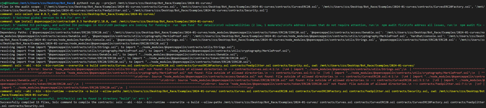
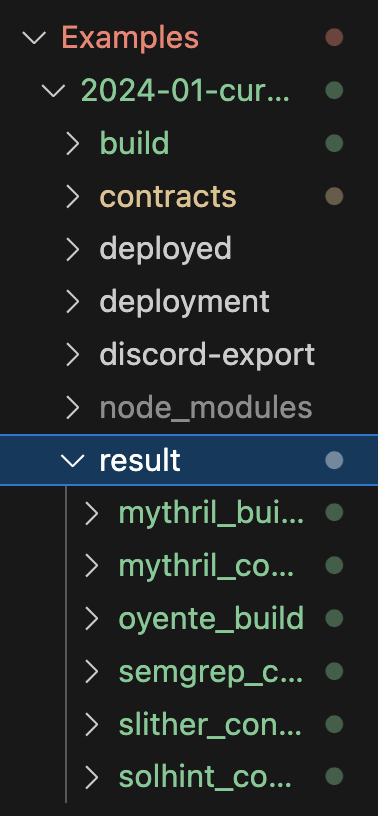

# SmartAuditor

## Requirements
Linux\MacOS\Windows:
* tree
    MacOS:
    ```bash
    brew install tree
    ```
    Linux:
    ```bash
    sudo apt install tree
    ```
* nodejs (https://nodejs.org/en)& npm（https://www.npmjs.com/）& yarn(https://github.com/yarnpkg/berry)
* solc-select
```bash
pip3 install solc-select
```
* Slither
```bash
python3 -m pip install slither-analyzer
```
* requirements install
```bash
pip install -r requirements.txt
```

## Set Audit Scope

Set an audit scope in [Scopes](./Scopes/), specifying the contracts need auditing, and change the imported scope in [run.py]#10(./run.py)

## Tests
Download contract project into [Examples](./Examples/)
For example:
```bash
cd Examples
git clone https://github.com/code-423n4/2024-01-curves --recursive
```
Run test in SmartAuditor:
```bash
python3 run.py --project /absolute/path/to/2024-01-curves/ --setup_message /absolute/path/to/2024-01-curves/README.md
```

### Result

#### Compile
The output is divided into two parts. The first part is compilation. It will mainly output basic information (in white), as well as the commands requested by GPT to be executed (in yellow), and the execution results (in green or red). As shown in the image, the command executed by GPT fails once (in red), then adjusts itself, and successfully compiles (in green).



#### 分析

The second part is the audit. It will mainly output in the result folder of audit project as showed in the picture below.



## Notice:

1. During the bot's runtime, the **resolve dependency** process **modifies the source code**, specifically by replacing `import` statements with the local file paths.

2. Since GPT responses are random, the output may vary. If there are errors, try multiple times.
3. During runtime, the bot will create a `build` folder in the directory where the project (e.g., `curves`) is located to store the bytecode files generated after compilation. It will also create a `setup_cache` folder to record the compilation results (all the information needed for subsequent analysis).
    After the project has been successfully compiled, if you run `python3 run.py --project` again, it will automatically load the `setup_cache` folder under the project and skip the compilation process, going directly to the analysis phase.

